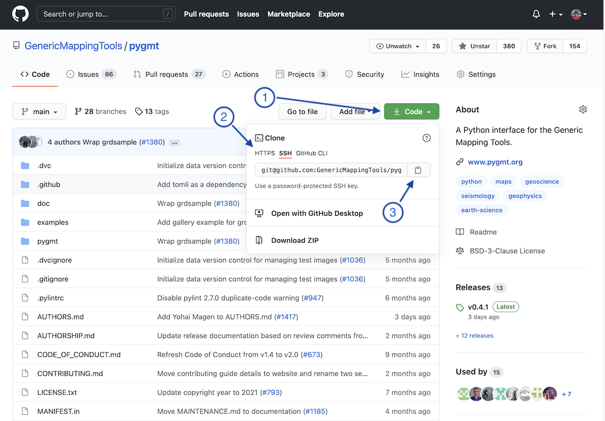

# Setting up your local development environment for PyGMT

We will use Git, Anaconda, and the `conda` package manager to install and
manage the development environment.

This guide assumes a basic understanding of git using the command line. For
more help, attend the optional setup session on August 17 and/or review the
[Software Carpentry](https://software-carpentry.org/)'s course on
[Version Control with Git](https://swcarpentry.github.io/git-novice/).

This guide also assumes that you are using a UNIX-type shell. If you
are working on a Windows machine, one option is to install and use
[Git for Windows](https://gitforwindows.org/).

## Cloning and forking the repository

**Note**: The steps in this section only need to be performed once per
repository.

1. **Clone the repository.**

   - In a browser, navigate to the
     [PyGMT repository](https://github.com/GenericMappingTools/pygmt).
   - Login to GitHub by clicking the 'Sign In' button in the top-left corner.
   - Click the green 'Code' button ①.
   - If you do not have
     [ssh keys set up](https://docs.github.com/en/github/authenticating-to-github/connecting-to-github-with-ssh),
     use the https url by first clicking the `https` button ②.
   - Copy the link by clicking the clipboard icon ③.
   - In a terminal window, navigate to the directory where you want to place
     the cloned PyGMT repository using `cd`.
   - Type `git clone clone-url` into the terminal (replace `clone-url`
     with the url that was copied to your clipboard).

   

2. **Fork the repository to your personal account.**

   - Click the `Fork` button on the
     [PyGMT page](https://github.com/GenericMappingTools/pygmt) ①. If you are
     presented with a list of organizations, click on your GitHub username.

   

3. **Add your fork as a remote.**

   - Go to your fork of the PyGMT repository:
     `https://github.com/your-username/pygmt` (replace `your-username` with
     your GitHub username) and copy the code url as in step 1.
   - In your terminal window, navigate into your cloned repository
     (e.g., `cd pygmt`).
   - Check that the repository was cloned successfully using `git status`.
   - In your terminal window, run `git remote add your-github-username fork-url`
     (replace `your-github-username` with your GitHub username and `fork-url`
     with the url that was copied to your clipboard). You will be able to tell
     it is your fork url because it will have your GitHub username in it.

## Setting up your conda development environment

1. Install [Anaconda](https://www.anaconda.com/products/individual) if you do
   not already have it installed.
2. In a terminal window, navigate to the base of the repository using `cd`.
3. Run `git status` to check that you are in the repository.
4. Run `conda env create` to create a new conda environment from the
   `environment.yml` file.

   **Note**: If you get a `conda: command not found` error, you'll need to
   add `conda` to your `$PATH` first, see instructions on
   https://stackoverflow.com/questions/35246386/conda-command-not-found.
   Afterwards, you may want to run `conda init`, and open a new terminal
   window (you may then need to repeat steps 2-4 again).

5. Run `conda activate pygmt` to activate the conda environment.
6. Run `make install` to install the current source code in your environment.
   If you are on Windows, you may need to use `pip install --no-deps -e .`
   instead.
7. Run `python -c "import pygmt; pygmt.show_versions()"` to check your
   installation.

## References

The steps in this guide are based on Aaron Meurer's
[Git workflow guide](https://www.asmeurer.com/git-workflow/) and the
[PyGMT Contributing Guide](https://www.pygmt.org/dev/contributing.html).
